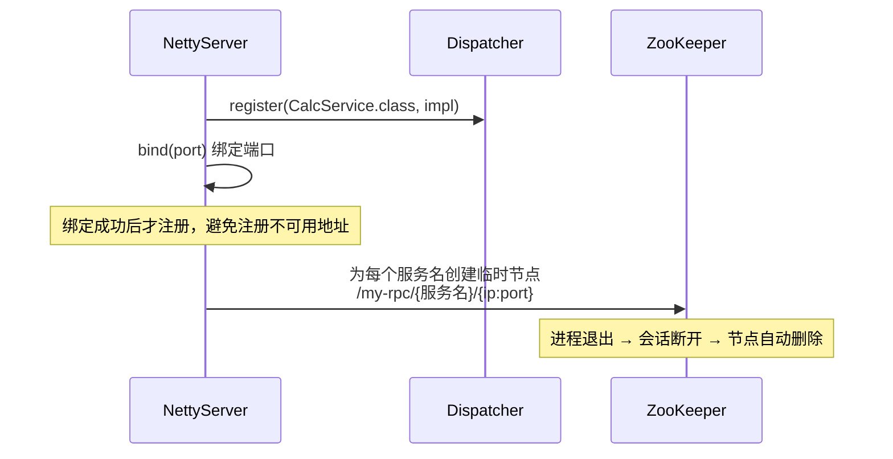
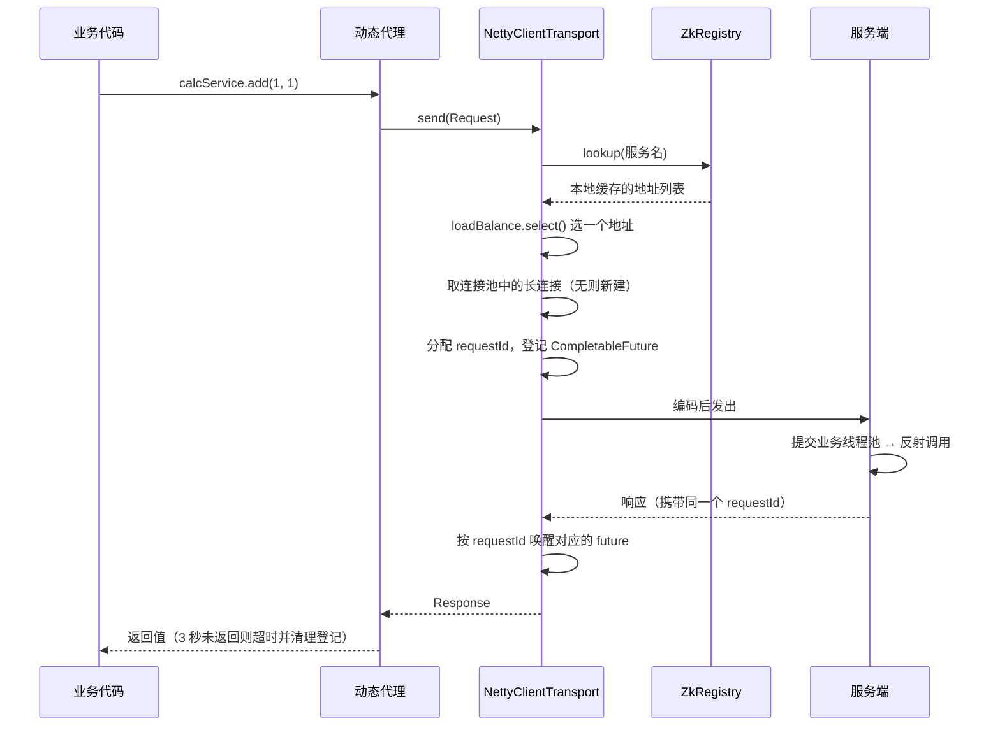
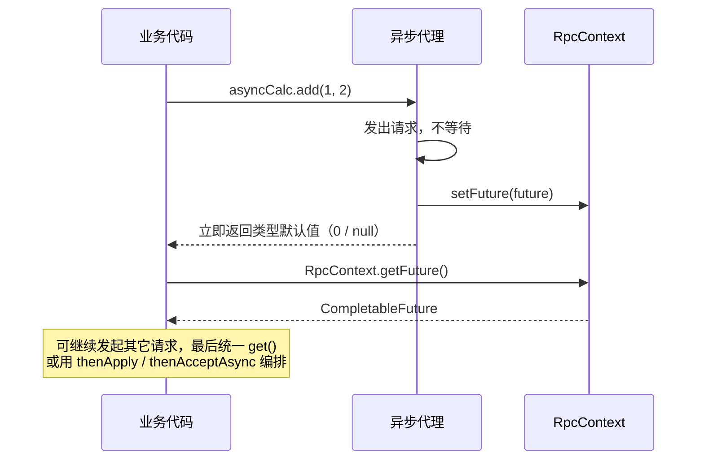

# 轻量级 RPC 框架

基于 **Netty + ZooKeeper** 从零实现的 RPC 框架。客户端通过动态代理像调用本地方法一样发起远程调用，支持同步 / 异步两种调用方式、服务自动注册与发现、负载均衡、长连接复用与心跳保活。

## 功能特性

- **自定义二进制协议**：20 字节定长消息头 + 变长 body，魔数校验拦截非法流量
- **解决 TCP 粘包 / 半包**：`LengthFieldBasedFrameDecoder` 基于长度字段分帧
- **可插拔序列化**：`Serializer` 接口 + 枚举注册，目前提供 JSON / Java 原生两种实现，序列化类型编码进协议头
- **透明远程调用**：JDK 动态代理屏蔽网络细节，服务端反射定位并调用目标方法
- **同步 + 异步调用**：同步调用 3 秒超时；异步调用返回 `CompletableFuture`，支持回调编排
- **请求响应精确匹配**：全局自增 requestId + `CompletableFuture` 挂起表，单连接上多请求并发不阻塞
- **服务注册与发现**：ZooKeeper 临时节点注册，进程退出自动摘除；客户端监听节点变化增量刷新本地缓存
- **负载均衡**：随机 / 轮询两种策略
- **长连接池**：一个服务地址一条长连接，断线自动摘除
- **心跳保活**：客户端写空闲 15 秒发送心跳，服务端读空闲 45 秒关闭连接
- **线程模型隔离**：业务逻辑提交独立线程池，不阻塞 Netty IO 线程
- **失败重试**：网络异常自动重试 3 次，业务异常直接抛出不重试

## 技术栈

| 层 | 技术 |
|---|---|
| 语言 | Java 17 |
| 网络通信 | Netty 4.1.115（NIO） |
| 注册中心 | ZooKeeper + Curator 5.7.1（curator-recipes） |
| 序列化 | Jackson 2.16（JSON） / Java 原生序列化 |
| 日志 | SLF4J 2.0.9 + Logback 1.4.11 |
| 构建 | Maven |
| 版本控制 | Git，Conventional Commits |

## 项目结构

```
src/main/java/org/example/
├── common/                      # 协议与公共模型
│   ├── ProtocolConstants.java   # 魔数、版本号、头长度、消息类型常量
│   ├── RpcMessage.java          # 协议层消息：头字段 + body
│   ├── Request.java             # 调用请求：服务名、方法名、参数类型、参数值
│   ├── Response.java            # 调用响应：success / data / error
│   ├── Serializer.java          # 序列化接口
│   ├── SerializerType.java      # 序列化实现的枚举注册表（code <-> 实现）
│   ├── JsonSerializer.java      # Jackson 实现
│   ├── JavaSerializer.java      # Java 原生序列化实现
│   ├── RpcException.java        # 框架 / 网络异常（可重试）
│   └── RpcBizException.java     # 业务方法抛出的异常（不重试）
├── codec/
│   ├── RpcEncoder.java          # RpcMessage -> 字节
│   └── RpcDecoder.java          # 字节 -> RpcMessage
├── registry/
│   ├── Registry.java            # 注册中心接口：register / lookup / close
│   └── ZkRegistry.java          # ZooKeeper 实现，含本地缓存与节点监听
├── loadbalance/
│   ├── LoadBalance.java         # 负载均衡接口
│   ├── RandomLoadBalance.java   # 随机
│   └── RoundRobinLoadBalance.java  # 轮询（AtomicInteger 保证并发安全）
├── transport/
│   ├── Transport.java           # 传输层接口：send / sendAsync / close
│   └── NettyClientTransport.java   # Netty 客户端：连接池 + 服务发现 + 负载均衡
├── client/
│   ├── RpcClient.java           # 动态代理入口：getProxy / getAsyncProxy
│   ├── PendingRequests.java     # 在途请求登记表：requestId -> CompletableFuture
│   ├── RpcContext.java          # ThreadLocal 传递异步调用的 future
│   ├── RpcResponseHandler.java  # 客户端入站处理：唤醒 future + 发送心跳
│   └── ClientApp.java           # 客户端示例程序
├── server/
│   ├── NettyServer.java         # 服务端启动：绑定端口 -> 注册到 ZK
│   ├── RpcRequestHandler.java   # 服务端入站处理：心跳应答 + 业务线程池派发
│   └── Dispatcher.java          # 服务注册表 + 反射调用
├── service/                     # 示例服务
│   ├── CalcService.java
│   └── CalcServiceImpl.java
├── CodecTest.java               # 编解码往返验证（EmbeddedChannel）
├── ServerPipelineTest.java      # 服务端完整流水线验证
├── RegistryTest.java            # 注册中心地址变化观察
└── LoadBalanceTest.java         # 负载均衡策略验证
```

> 说明：四个 `*Test.java` 是带 `main()` 的手动验证程序，用 Netty 的 `EmbeddedChannel` 在不启动真实网络的情况下验证流水线，**不是** JUnit 单元测试。补自动化测试见「后续规划」。

## 通信协议

### 消息格式

```
0        4    5    6    7    8                16               20
+--------+----+----+----+----+----------------+----------------+---------+
| 魔数   |版本|序列|类型|状态|    请求 ID     |   body 长度    |  body   |
| 4字节  |1B  |化1B|1B  |1B  |     8 字节     |     4 字节     |  变长   |
+--------+----+----+----+----+----------------+----------------+---------+
|<--------------------- 定长消息头 20 字节 --------------------->|
```

| 偏移 | 长度 | 字段 | 说明 |
|---|---|---|---|
| 0 | 4 | 魔数 | `0x72706301`，不匹配直接关闭连接 |
| 4 | 1 | 版本号 | 当前为 1，为协议升级预留 |
| 5 | 1 | 序列化类型 | 0 = JSON，1 = Java 原生 |
| 6 | 1 | 消息类型 | 1 = 请求，2 = 响应，3 = 心跳 |
| 7 | 1 | 状态位 | 0 = 成功，1 = 失败 |
| 8 | 8 | 请求 ID | 客户端全局自增，用于响应匹配 |
| 16 | 4 | body 长度 | 心跳包写 0 |
| 20 | 变长 | body | 序列化后的 `Request` / `Response`，心跳无 body |

### 分帧

编解码器前挂 `LengthFieldBasedFrameDecoder(1MB, 16, 4, 0, 0)`：长度字段在偏移 16 处、占 4 字节，不剥离任何前置字节。走到 `RpcDecoder` 时手上一定是一条完整消息，解码器只管按顺序读字段，不用关心 TCP 粘包 / 半包。

## 调用流程

### 服务端启动与注册



### 一次同步调用



### 异步调用



## 关键设计决策

**为什么用长度字段分帧而不是分隔符？**
body 是二进制序列化结果，任何分隔符字节都可能出现在 body 内部。长度字段是二进制协议的通用解法，也是 Dubbo / gRPC 的做法。

**序列化类型为什么放在协议头里？**
放进头部意味着序列化方式是「每条消息」的属性而不是「全局配置」：服务端读到 code 才决定用哪个实现反序列化，客户端换序列化方式不需要服务端改配置。新增一种序列化只要实现 `Serializer` 并在枚举里加一行，编解码逻辑完全不动。

**请求 ID 存在的意义**
一条 TCP 长连接上可以有多个请求同时在途，响应回来的顺序不保证与发出顺序一致。用 `ConcurrentHashMap<Long, CompletableFuture>` 把「已发出、未响应」的请求挂起，响应按 requestId 精确唤醒对应的那个 future —— 这是异步调用和单连接并发的地基。响应找不到对应 future，说明该请求已经超时被清理，直接丢弃即可。

**同步调用其实是异步的特例**
`send()` 内部走的也是 `doSend()` + future，只是紧接着 `future.get(3, SECONDS)` 把自己阻塞住。同步与异步共用一条发送路径，没有两套逻辑。

**为什么业务处理要另起线程池？**
Netty 的 IO 线程负责所有 channel 的读写，业务方法一旦耗时（如示例中的 `show()` 睡 2 秒），会连带拖垮同一个 EventLoop 上的其它连接。业务逻辑提交到独立线程池后，IO 线程只做编解码和派发。线程池用 `CallerRunsPolicy`：队列满时由提交线程（IO 线程）自己执行，形成天然的背压，比直接丢弃请求安全。

**注册中心为什么用临时节点？**
服务提供者进程崩溃时不会有机会执行注销逻辑。临时节点绑定 ZK 会话，会话超时节点自动消失，把「摘除下线节点」的责任交给 ZK 而不是应用代码。

**客户端为什么要缓存地址列表？**
每次调用都查 ZK 会让注册中心成为调用链上的性能瓶颈和单点。改为「首次订阅时拉全量 + CuratorCache 监听增删后增量刷新」，调用路径上只读本地 `ConcurrentHashMap`。刷新失败时**故意不清空缓存**：注册中心抖动不应该导致已有的可用地址全部失效。

**心跳为什么是「客户端写空闲发、服务端读空闲断」？**
两端时间不对称（15 秒 / 45 秒）是刻意的：服务端的超时必须显著大于客户端的心跳间隔，否则网络抖一下丢一个心跳包就会误判断连。45 秒容忍连续丢两个心跳。

**为什么区分 `RpcException` 与 `RpcBizException`？**
网络超时、连接失败这类问题重试可能成功；而业务方法本身抛的异常（参数非法、余额不足）重试多少次结果都一样，重试只会放大副作用。异常分类是「该不该重试」的判断依据。

**连接池的双重检查锁**
`getChannel()` 先无锁读 map（快路径，绝大多数调用走这里），未命中才进 `synchronized` 并再查一次 —— 避免多个线程同时给同一个地址建连接。同时给新连接挂 `closeFuture` 监听，断开时用 `remove(key, value)` 条件删除，保证摘掉的是自己那条连接而不是别人刚建的新连接。

## 本地运行

### 环境要求

- JDK 17
- Maven 3.8+
- ZooKeeper 3.8+（本地 2181 端口）

### 1. 启动 ZooKeeper

Mac 推荐 Homebrew：

```bash
brew install zookeeper
brew services start zookeeper
# 验证
echo ruok | nc localhost 2181     # 返回 imok 即正常
```

### 2. 启动服务端

```bash
mvn clean compile
mvn exec:java -Dexec.mainClass="org.example.server.NettyServer"
```

不传参数默认监听 8080。想验证负载均衡，再开一个终端起第二个实例：

```bash
mvn exec:java -Dexec.mainClass="org.example.server.NettyServer" -Dexec.args="8081"
```

也可以直接在 IDEA 里运行 `NettyServer`，多实例通过 Run Configuration 的 Program arguments 传端口。

### 3. 启动客户端

```bash
mvn exec:java -Dexec.mainClass="org.example.client.ClientApp"
```

`ClientApp` 会依次演示：同步调用、两个请求并行的异步调用、`thenAccept` 回调（跑在 Netty IO 线程）、`thenAcceptAsync` 指定线程池回调。

### 4. 单独验证各模块（无需启动 ZK）

| 类 | 验证内容 |
|---|---|
| `CodecTest` | 编码 → 解码往返，检查字节数与字段还原 |
| `ServerPipelineTest` | 伪造客户端字节喂进服务端完整流水线，检查响应 |
| `LoadBalanceTest` | 轮询策略的分发顺序 |
| `RegistryTest` | 需要 ZK，持续打印当前可用地址，可配合起停服务端观察节点增删 |

## 已知限制 & 后续规划

- [x] 自定义协议 + 编解码 + 粘包半包处理
- [x] 可插拔序列化（JSON / Java 原生）
- [x] 动态代理 + 反射调用
- [x] 同步 / 异步调用与请求响应匹配
- [x] ZooKeeper 服务注册与发现 + 本地缓存
- [x] 随机 / 轮询负载均衡
- [x] 长连接池 + 心跳保活
- [x] 业务线程池隔离 + 失败重试
- [ ] **自动化测试**：目前只有 `main()` 手动验证，应补 JUnit 5 单元测试（编解码往返、负载均衡分发、异常分类）
- [ ] **JSON 序列化的复杂参数**：`Request.args` 是 `Object[]`，Jackson 反序列化后丢失具体类型（POJO 变 `LinkedHashMap`，整数字面量变 `Integer` 导致 `double` 参数的方法反射调用失败）。当前示例服务参数都是基本类型故未暴露；正解是改用 Protobuf / Kryo，或在协议里带上参数类型信息
- [ ] **配置外部化**：超时 3 秒、重试 3 次、心跳 15/45 秒、线程池参数目前都硬编码
- [ ] **重试与幂等**：当前对所有方法一视同仁地重试，非幂等方法（如扣款）应支持关闭重试
- [ ] **服务端地址硬编码**：注册时写死 `127.0.0.1`，多机部署需改为读取真实网卡地址
- [ ] Spring Boot Starter + 注解驱动（`@RpcService` / `@RpcReference`）替代手动 `Dispatcher.register`
- [ ] 更多负载均衡策略（一致性哈希、加权轮询）与熔断降级

## 踩坑记录

**Curator 与 Netty / Logback 的依赖冲突**
`curator-recipes` 自带一套 Netty 和 logback，与项目直接依赖的版本打架。在 pom 里对 curator 做 `<exclusions>` 排除掉 `io.netty:*` 和 `ch.qos.logback:*`，统一由项目自己管理版本。

**编解码器的读写顺序必须严格对称**
`RpcEncoder` 写字段的顺序和 `RpcDecoder` 读的顺序错一位，解出来的就是一堆看不懂的数字。编码时还必须**先序列化 body 拿到长度，再写长度字段**，不能先占位后回填。

**`afterInitialized()` 与初始事件**
`CuratorCache` 启动时会把已有节点当作「新增」事件全部推一遍，不加 `afterInitialized()` 会在初始化阶段触发一堆无意义的刷新。加上之后忽略初始同步事件，初始数据由 `refresh()` 自己主动拉一次，时机精确可控。

**注册的时机**
最初把「注册到 ZK」写在 `bind()` 之前，结果端口被占用启动失败时，ZK 里已经躺着一个不可用的地址，客户端照样往上打。改成绑定成功之后才注册。

**异步回调跑在哪个线程**
`thenAccept` 的回调默认由完成 future 的那个线程执行，也就是 Netty 的 IO 线程 —— 在回调里做耗时操作等于又把 IO 线程堵上了。要用 `thenAcceptAsync(fn, executor)` 显式指定业务线程池。`ClientApp` 里把两种写法都跑了一遍，打印线程名可以直观看到区别。
